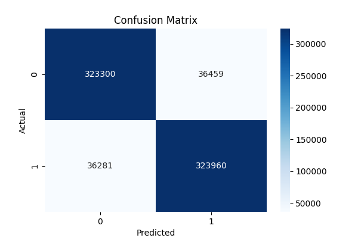

# 🧠 Amazon Sentiment Classifier

A fast and effective sentiment classification project using 3.6 million Amazon product reviews.  
Built with Logistic Regression, TF-IDF, and classic preprocessing — this project demonstrates scalable NLP on real-world data.

---

## 📦 Dataset
- **Source**: Amazon Reviews from Kaggle (`train.ft.txt`)
- **Size**: 3,600,000 reviews
- **Labels**:  
  - `__label__1` = Negative  
  - `__label__2` = Positive  
- **Format**: FastText-style plain text

---

## 🧰 Tools & Stack
- Python 3.12
- Jupyter Notebook (VS Code)
- Pandas, Scikit-learn, Matplotlib, Seaborn

---

## 🧪 Workflow Overview

| Step | Description |
|------|-------------|
| 1️⃣  | Load FastText-style dataset (`.txt`) |
| 2️⃣  | Clean and normalize text |
| 3️⃣  | Vectorize text using TF-IDF |
| 4️⃣  | Train a Logistic Regression classifier |
| 5️⃣  | Evaluate using classification report and confusion matrix |

---

## 📈 Results

- **Accuracy**: ~90%
- **F1-Score**: 0.90
- **Model**: Logistic Regression
- **Features**: Top 5000 TF-IDF terms

### 📊 Confusion Matrix

<p align="center">
  
</p>

---

## 🚀 How to Run

1. Clone this repository:
   ```bash
   git clone https://github.com/outeast98/amazon-sentiment-classifier.git
   cd amazon-sentiment-classifier
   ```

2. Install dependencies:
   ```bash
   pip install -r requirements.txt
   ```

3. Open the Jupyter notebook:
   ```bash
   sentiment_analysis.ipynb
   ```
   and run each cell step by step.

---

## 💡 Project Highlights

- End-to-end NLP pipeline  
- Real-world scale (3.6M reviews)  
- TF-IDF + Logistic Regression baseline  
- Clear results with confusion matrix  

---

## 👨‍💻 Author

**Yevhenii Aloshyn**  
Machine Learning & Cybersecurity Enthusiast  
📍 Toronto, Canada  
[GitHub](https://github.com/outeast98)